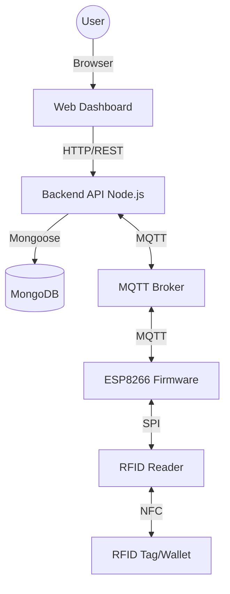

# Architecture Diagram

## Data Flow
1. RFID Tag is scanned by the Reader.
2. ESP8266 reads the UID and publishes to `rfid/wallet/scan`.
3. Backend API receives the message, validates the UID in MongoDB.
4. Backend API processes the transaction (Atomic Update).
5. Backend API publishes results to `rfid/wallet/response`.
6. Dashboard polls Backend API every 3s via HTTP to show latest state.
